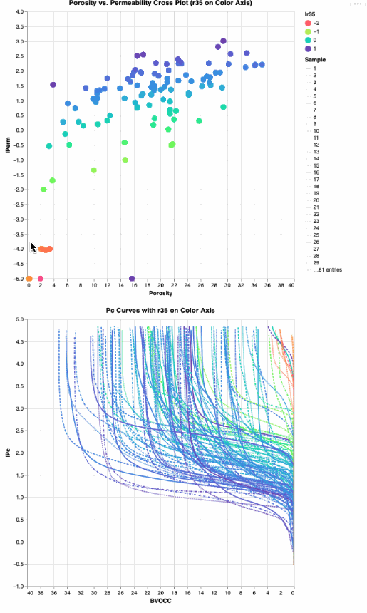

# Characterization-of-a-New-Open-Source-Carbonate-Reservoir-Benchmarking-Case-Study-by-Costa
We have used the new hierarchical carbonate reservoir benchmarking case study created by Costa Gomes J, Geiger S, Arnold D to be used for reservoir characterization, uncertainty quantification and history matching(1). 

In this repository we have used this new hierarchical carbonate reservoir benchmarking case study with a comprehensive reservoir characterization database including well logs, routine and Special Core Analysis, 3D static and dymanic models and dynamic data including production and formation pressures as created by Costa, Geiger and Arnold. 

We used all core data, 17 well logs and the dynamic data in our Petrophysical characterization of this carbonate reservoir. We also included the full Geolog project with Geolog python loglans and data.

This project follows tried and proven workflow as described by Phillips et al.(2) used in the characterization of a typical carbonate reservoirs in the Middle East.Permeability, Petrophysical Rock Types (PRT), Capillary Pressure and modeled saturations are all estimated or calculated using this workflow in order to characterize this reservoir, and Costa's core analysis database is used as the calibration data. 

We used Costa's core data as calibration for our our characterization. There are 110 High Pressure Mercury Injection (HPMI) core samples used to build our Thomeer Parameter Capillary Pressure core database. We fit the Thomeer hyperbola to the HPMI and establish the Thomeer parameters. This GitHub repository uses python loglan code to load High Pressure Mercury Injection (HPMI) Core data directly from the Costa SCAL set in the Geolog Well and then model the HPMI data using a Thomeer hyperbola by our estimations of the Thomeer Capillary Pressure parameters as shown below. This portion of the Geolog project serves as an example for the user to build their own reservoir-specific core calibration database for their Reservoir Characterization studies. 

### Suggested Carbonate Workflow:
The following workflow and processing is suggested to interrogate, process, interpret and model the petrophysical properties for this benchmark carbonate reservoir using Costa's High Pressure Mercury Injection core database as calibration. The workflow consists of the following steps:

1) Interrogate the Well Log data and Costa calibration data using standard Geolog layouts, cross plots and histograms and then use a python loglan featuring Altair, which is interactive software driven from a Geolog Module Launcher.

##### Altair used to Interrogate the Costa Capillary Pressure curves and Petrophysical Rock Types (PRTs):

2) Run MultiMin for a solid log analysis model using the typical minerals found in thia reservoir; Limestone, Dolomite, and Illite. With MultiMin we always use environmentally corrected log data and use the calculated uncertainties for each log curve employed in the analysis. 

3) Use available core data from the representative reservoir/field to build a petrophysical model to estimate permeability for all wells in field using either Geolog's Facimage or our python loglan using kNN using normalized input data and weighted by Euclidean distances for each of the nearest neighbors. 

4) Using the kNN estimated permeability and calculated Total Porosity (PHIT) from MultiMin, we query Costa's core database to predict the following Petrophysical results:
    - Thomeer Capillary Pressure parameters (Pdi, Gi and BVocci) for each pore system i over the reservoir interval
    - Estimate the most dominant pore throat diameter at each level in the well calculated from the Thomeer parameters G and Pd. 

5) Use the Thomeer Capillary Pressure parameters to model saturations based on the buoyancy due to fluid density differences at the height above the Free Water Level (FWL). In this instance we compare the Bulk Volume Oil (BVO) from MultiMin vs. BVO from Thomeer-based capillary pressure saturations since BVO is pore volume weighted.

### RESOURCES:
https://researchportal.hw.ac.uk/en/datasets/costa-model-hierarchical-carbonate-reservoir-benchmarking-case-st

https://github.com/Philliec459?tab=repositories

1. Costa Gomes J, Geiger S, Arnold D. The Design of an Open-Source Carbonate Reservoir Model. Petroleum Geoscience, 
    https://doi.org/10.1144/petgeo2021-067
3.	Phillips, E. C., Buiting, J. M., Clerke, E. A, “Full Pore System Petrophysical Characterization Technology for Complex Carbonate Reservoirs – Results from Saudi Arabia”, AAPG, 2009 Extended Abstract.
4.	Clerke, E. A., Mueller III, H. W., Phillips, E. C., Eyvazzadeh, R. Y., Jones, D. H., Ramamoorthy, R., Srivastava, A., (2008) “Application of Thomeer Hyperbolas to decode the pore systems, facies and reservoir properties of the Upper Jurassic Arab D Limestone, Ghawar field, Saudi Arabia: A Rosetta Stone approach”, GeoArabia, Vol. 13, No. 4, p. 113-160, October, 2008. 
 
