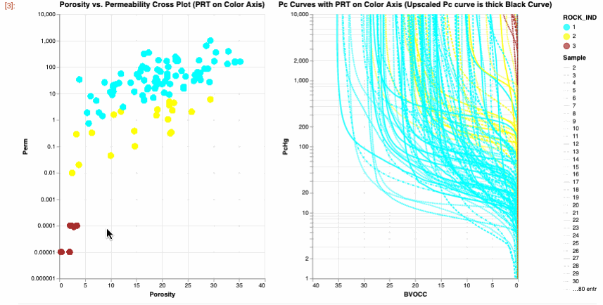
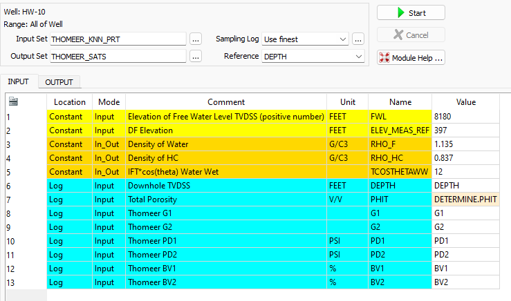
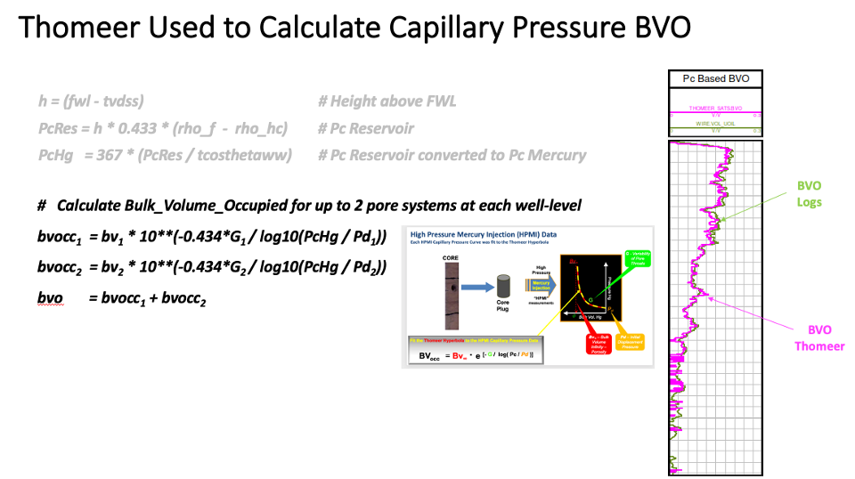
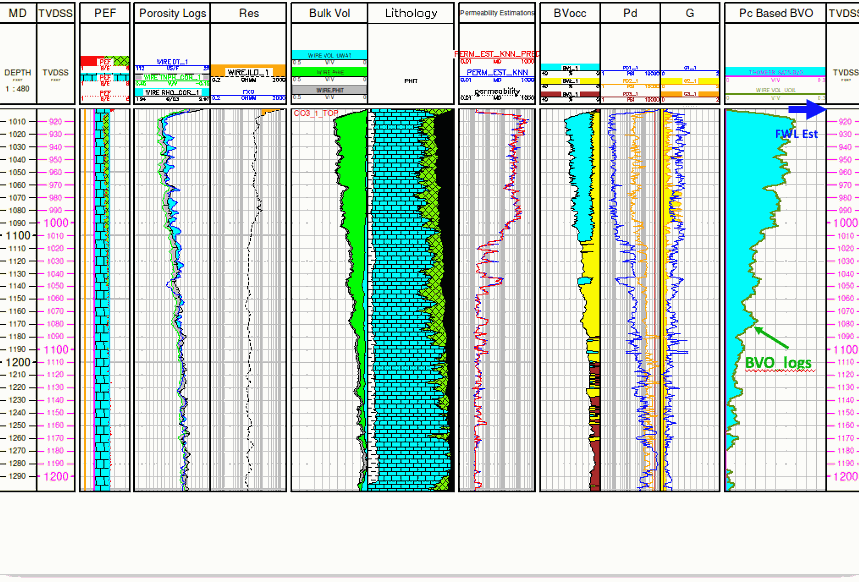
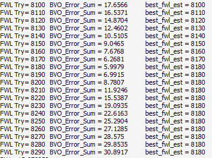
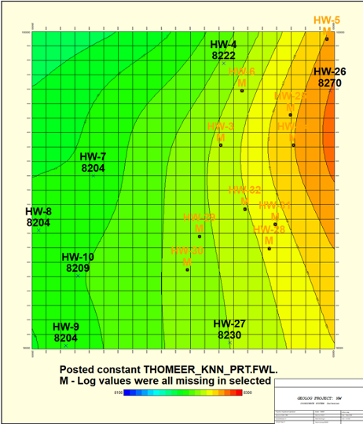
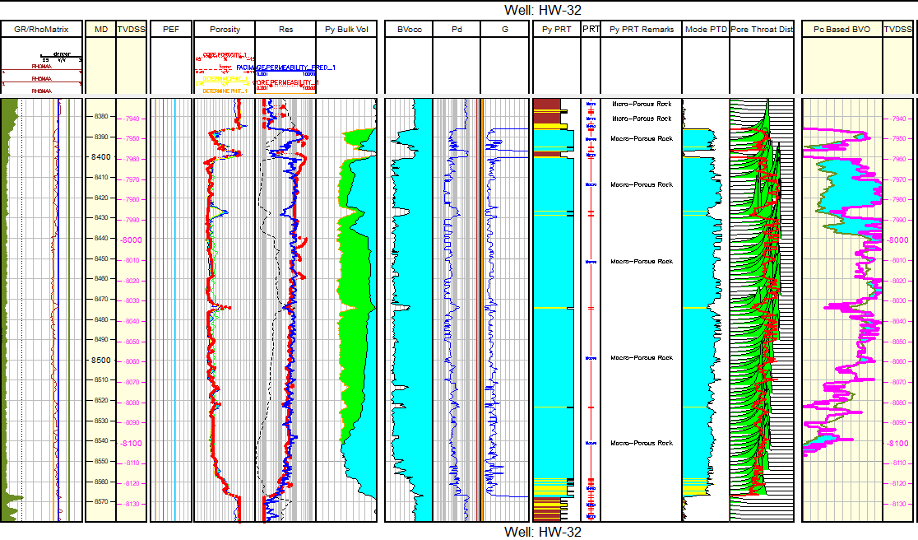

# Characterization-of-a-New-Open-Source-Carbonate-Reservoir-Benchmarking-Case-Study-by-Costa
We have used the new hierarchical carbonate reservoir benchmarking case study created by Costa Gomes J, Geiger S, Arnold D to be used for reservoir characterization, uncertainty quantification and history matching. 

---
># This is WORK IN PROGRESS, but we do have an initial Geolog Project in a zip file for you to download with Geolog python loglans. 
>- We will also add Jupyter Notebooks soon with full documentation on the carbonate reservoir characterization process
---

# Introduction
**According to Costa, Geiger and Arnold(1):**
> *This work presents a new open-source carbonate reservoir case study, the COSTA model, that uniquely considers significant uncertainties inherent to carbonate reservoirs, providing a far more challenging and realistic benchmarking test for a range of geo-energy applications. The COSTA field is large, with many wells and large associated volumes. The dataset embeds many interacting geological and petrophysical uncertainties in an ensemble of model concepts with realistic geological and model complexity levels and varying production profiles. The resulting number of different models and long run times creates a more demanding computational challenge than current benchmarking models.*
> 
> *The COSTA model takes inspiration from the shelf-to-basin geological setting of the Upper Kharaib Member (Early Cretaceous), one of the most prolific aggradational parasequence carbonate formations sets in the world. The dataset is based on 43 wells and the corresponding fully anonymized data from the north-eastern part of the Rub Al Khali basin, a sub-basin of the wider Arabian Basin. Our model encapsulates the large-scale geological setting and reservoir heterogeneities found across the shelf-to-basin profile, into one single model, for geological modelling and reservoir simulation studies.*
> 
> *The result of this research is a semi-synthetic but geologically realistic suite of carbonate reservoir models that capture a wide range of geological, petrophysical, and geomodelling uncertainties and that can be history-matched against an undisclosed, synthetic 'truth case'. The models and dataset are made available as open-source to analyze several issues related to testing new numerical algorithms for geological modelling, uncertainty quantification, reservoir simulation, history matching, optimization and machine learning.*

In this GitHub repository we have used a new, comprehensive carbonate reservoir characterization database from Costa, Geiger and Arnold (1). We employed all the available well logs, Routine Core Analysis (RCA) and Special Core Analysis (SCAL and implemented our standard carbonate reservoir characterization workflow as discussed by Phillips et al. (2). Considering the scope of this project repository, we did not use Costa's 3D static or dynamic models, but we did employ their time-series dynamic production and formation pressure data by well using Spotfire to visualize the pressure and production data and better understand the dynamic aspects of this reservoir. This is a rich dataset that needs to be explored further, more than what is presented in the scope of this project.  For those working with carbonate data and wanting to apply your characterization skills, this is a perfect dataset to work with and even publish your findings. Released carbonate field data is like this is practically nono-existant. Enjoy!

The provided RCA and SCAL core data as well as the 17 well logs in the form of las files were all imported into Geolog and avaialble in this repository as a Geolog project.  We used these data extensively in our Petrophysical evaluation. The following depth plot shows a typical well from the field and the type of analysis performed on each well. 

The reservoir characterization process used in this repository follows a tried and proven workflow as described by Phillips et al. (2) in the characterization of another carbonate reservoir, the Arab D carbonate reservoirs from Saudi Arabia. Core Porosity, Permeability, Petrophysical Rock Types (PRT), Capillary Pressure and capillary pressure-based saturations are all estimated or calculated for each of the 17 wells using this workflow. Just as with our previous studies, the provided core analysis database for this project was used as the foundation and calibration to these petrophysical interpretations and estimations. 

Costa also provided 110 High Pressure Mercury Injection (HPMI) core samples that had RCA Porosity and Permeability too. We performed a Thomeer Parameter Analysis on each of the HPMI samples to establish our own, reservoir specific Thomeer Parameter Capillary Pressure core database that was used to model petrophysical properties, Petrophysical Rock Types (PRT) and saturations. We conducted the Thomeer analysis in Geolog by fitting a Thomeer hyperbola to each of the 110 HPMI samples to establish the Thomeer Capillary Pressure parameters for each sample. A python loglan was first used to load the High-Pressure Mercury Injection (HPMI) Core data directly from the Costa SCAL dataset into a Geolog Well, and then a Geolog loglan was written to model the HPMI data using the Thomeer parameters creating the Thomeer hyperbola fitting the Pc data. We employed Scipy's curve_fit in python to fit the Capillary Pressure curve from this analysis that match the actual HPMI sample in over 95% of the samples. As with any core database, there were a few questionable samples that either had questionable RCA or the Pc curves themselves. A few samples were difficult to fit probably due undistinguishable multiple pore systems. 

### Suggested Carbonate Workflow:
The following workflow and processing were used to interrogate, process, interpret and model the petrophysical properties for this benchmark carbonate reservoir using Costa's RCA and High-Pressure Mercury Injection core database as calibration. The workflow consists of the following steps:

1) Interrogate the Well Log data and Costa calibration data using standard Geolog layouts, cross plots, and histograms; and then use python loglans featuring Altair, which is interactive software driven from a Geolog Module Launcher. Altair was used to interrogate both the well log data and HPMI Thomeer Parameter core database. 

**Altair used to Interrogate the Costa Capillary Pressure curves and Petrophysical Rock Types (PRTs):**

2) Normally we would run MultiMin for our log analysis model using the typical minerals found in this carbonate reservoir; Limestone, Dolomite, and Illite. However, to make this dataset more universal, we have employed python to perform both our deterministic and optimization types of log analysis for the 17 wells we have with log data. The Geolog loglan code is provided in the Geolog project. 

We received the log data as 17 las files with a text file of log header data including X,Y locations, KB elevation and TD.  There were no directional survey data provided. It is assumed that these wells are all vertical wells, and TVDss was calculated using the KB Elevations for each well. 

3) We used the available core data from this Costa reservoir/field example to build a petrophysical model to estimate permeability for all wells using Geolog's Facimage. We will also include a python loglan using kNN with normalized input data weighted by Euclidean distances for each of the nearest neighbors to make our final permeability estimation for each well. 

4) Using the kNN or Facimage estimated permeability and calculated Total Porosity (PHIT) from our log analysis, we queried Costa's core database to predict the following Petrophysical properties:

    - Thomeer Capillary Pressure parameters (Pdi, Gi and BVocci) for each pore system, i, over the entire reservoir interval to be used for Capillary Pressure-based saturations
    - Estimate the most dominant pore throat diameter at each level in each well calculated directly from the Thomeer parameters G and Pd using the Buiting equation shown below. 

This exact mode of the Pore Throat Distribution (PTD) is calculated using the following Buiting equation:

			Mode of PTD (microns) = exp(-1.15 * G1) * (214/Pd1)

This exact Mode of the PTD is what Winland was trying to accomplish with his r35 or Amaefule with FZI; however, they are not exact. We have another GitHub repository under Phillips459 that shows a comparison of these rock typing techniuqes that should be used to see an actual comparison of the different rock typing methonds using the Mode of the PTD calculated from Ed Clerke's Arab D carbonate core dataset with Thomeer Parameters. 

https://github.com/Philliec459/NEW-Carbonate-Characterization-Workflow-Jupiter-Notebook-Modules-with-Clerke-Arab-D-Calibration-Data

Use the *1_Workflow_Intro_with_Altair_Interrogation_Log_and_RosettaStone_Data.ipynb* Jupyter Notebook to see a comparison of numerous Rock Typing methods on Clerke's Arab D carbonate core database.

The Mode of the PTD calculated from the Buiting equation is taken directly from the Capillary Pressure data and is the exact mode of the PTD that correlates to other petrophysical parameters extremely well. We use the Mode of the PTD to model the petrophysical properties in the 3D model too. 

We used the Mode of the PTD to partition our data into Petrophysical Rock Types (PRT). We assigned a Macro porous PRT to the level in the well if the Mode > 2 microns. If the Mode > 0.1 micron but Mode < 2 microns, then this was considered to be a Meso porous PRT. If the Mode < 0.1 microns, then this rock was considered to be a Micro porous PRT. This is still work in progress. The following image shows all 110 HPMI Capillary Pressure curves with the PRT designation of Macro porous rock being cyan, Meso being yellow and Micro being brown. 

5) The Thomeer Capillary Pressure parameters are used to model saturations based on the buoyancy due to fluid density differences at a given height above the Free Water Level (FWL). In this instance we compare the Bulk Volume Oil (BVO) from our analysis vs. BVO from Thomeer-based capillary pressure saturations to judge our Capillary Pressure model. We have used BVO since BVO is pore volume weighted.

We did perform a Free Water Level (FWL) search for each well to establish the FWL for this reservoir. As discussed above we used the Thomeer parameters to model Capillary Pressure based saturations as shown below:

In our FWL search, we varied the FWL from the highest potential FWL elevation (8100' TVDss) down to the lowest potential FWL elevation for the reservoir (8300' TVDss) and estimate the FWL for each well where the error difference between the BVO from logs vs. Capillary Pressure was at a minimum. 

This is an example of the single well output from our FWL search. This FWL search was performed on all wells in the study. in the printout example below, we varied the FWL by 10-foot increments, but in our actual study we varied the initial FWL estimates in 1 foot increments. 

Not all wells are useful in establishing the FWL elevation of the field. A few of the wells were too high on structure where were we were really estimating the Base of Reservoir (BOR). There were also a few wells that were nearly 100% wet, and they too were not used to establish the final FWL surface. Eliminating these wells allowed us to establish the following FWL surface for this reservoir from a few key wells as shown below:

Our estimated FWL surface is a plane but tilted with a high elevation of 8176 feet TVDss on the West, dipping to the East to a maximum FWL elevation of 8215 feet TVDss. Tilted FWL’s are quite prevalent in Saudi Arabia due to dynamic aquifer pressures, tilted structures and even subduction. We are not as familiar with the location of this field, but some of the conditions cound have been present in this field too. The FWL Surface was then used with the estimated Thomeer parameters on each well to calculate the final Capillary Pressure based saturations on each well in the field. The timing of drilling of each well is not understood, but HW-32 might be showing signs of water encroachment as seen in the figure below. 

For the 3D static model, the Thomeer parameters on each well can be distributed thoughout the model or calculated from the Mode of the PTD that was calculated from a distributed Porosity and Permeability in the 3D static, fine-grid model. The points of intersection of the FWL surface at each well is then used to build the FWL plane. This FWL surface is then used with the modeled Thomeer parameters to estimate the original saturations for the field prior to production estimating OOIP from the FWL and above. 

Finally, as with most of our studies we want to be able to integrate our Petrophysical findings with the dynamic production and pressure data to better understand the productive characteristics of this reservoir to be able to maximize recovery with sustained production over the life of this field.

### RESOURCES:
https://researchportal.hw.ac.uk/en/datasets/costa-model-hierarchical-carbonate-reservoir-benchmarking-case-st

https://github.com/Philliec459/Geolog-Used-to-Model-Thomeer-Parameters-from-High-Pressure-Mercury-Injection-Data

https://github.com/Philliec459/Geolog-Used-to-Automate-the-Characterization-Workflow-using-Clerkes-Rosetta-Stone-calibration-data

### REFERENCES:
1.  Costa Gomes J, Geiger S, Arnold D. The Design of an Open-Source Carbonate Reservoir Model. Petroleum Geoscience, 
    https://doi.org/10.1144/petgeo2021-067
2.  Phillips, E. C., Buiting, J. M., Clerke, E. A, “Full Pore System Petrophysical Characterization Technology for Complex Carbonate Reservoirs – Results from Saudi Arabia”, AAPG, 2009 Extended Abstract.
3.  Clerke, E. A., Mueller III, H. W., Phillips, E. C., Eyvazzadeh, R. Y., Jones, D. H., Ramamoorthy, R., Srivastava, A., (2008) “Application of Thomeer Hyperbolas to decode the pore systems, facies and reservoir properties of the Upper Jurassic Arab D Limestone, Ghawar field, Saudi Arabia: A Rosetta Stone approach”, GeoArabia, Vol. 13, No. 4, p. 113-160, October 2008.
